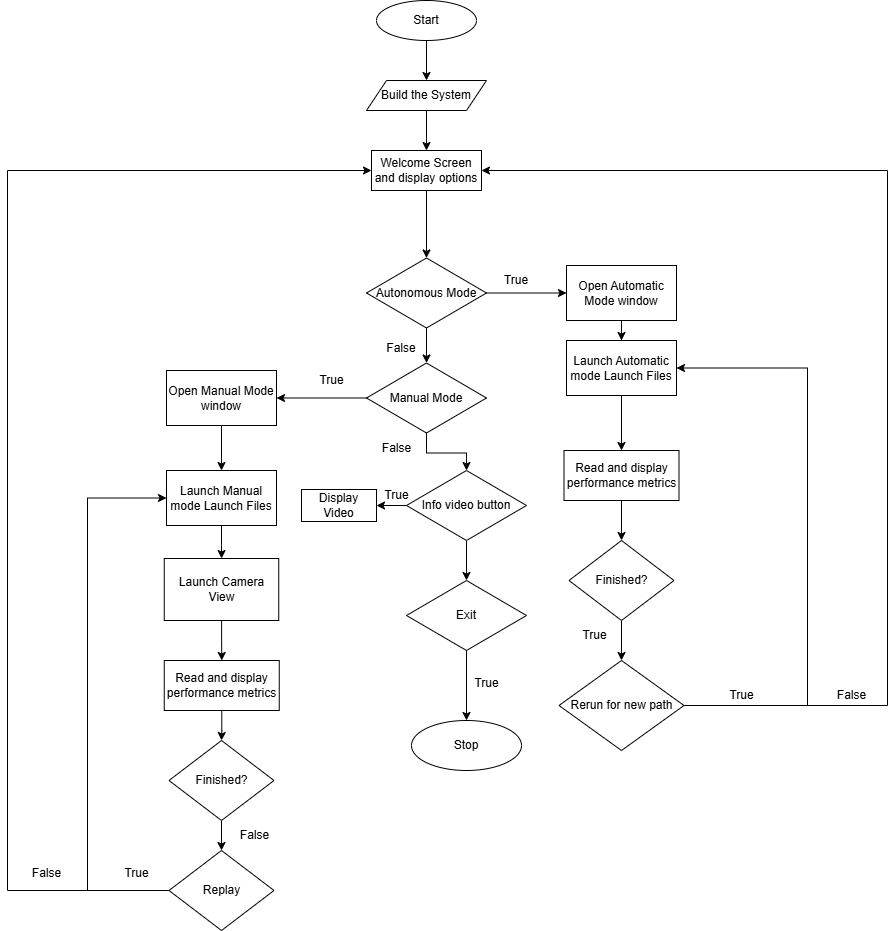

# Weed-Terminator Demonstrator Documentation

## Table of Contents

1. [Introduction](#1-introduction)
   - [Purpose of the Documentation](#purpose-of-the-documentation)  
   - [Project Overview](#project-overview)  
   - [Why Python and PyQt?](#why-python-and-pyqt)  
   
2. [Graphical User Interface](#2-graphical-user-interface)
   - [GUI Features](#gui-features)
   - [GUI FlowChart](#gui-flowchart)
   - [GUI Design](#gui-design)

3. [Getting Started](#3-getting-started)  
   - [Setup and Installation](#setup-and-installation)  
     - [Clone the Repository](#clone-the-repository)  
     - [ROS Workspace](#ros-workspace)  
     - [Installing Libraries](#installing-libraries)

4. [Code Structure](#4-code-structure)  
    - [main_window.py](#main_windowpy)  
    - [manual_mode_window.py](#manual_mode_windowpy)  
    - [autonomous_mode_window.py](#autonomous_mode_windowpy) 
    - [camera_view_window.py](#camera_view_windowpy)
   
5. [Main Window](#main-window)  
   - [Code Functions](#code-functions)  
     - [Create Menu Bar](#create-menu-bar) 
     - [Layout](#layout)
     - [Open Windows](#open-windows)
     - [Help Buttons](#help-buttons)
     - [Homing & Idle](#homing-and-idle)
     - [Main Function](#main-function)

6. [Manual Mode Window](#manual-mode-window)  
    - [Code Functions](#code-functions-1)  
      - [Launching The Manual Files](#launching-the-manual-mode-files)

7. [Autonomous Mode Window](#autonomous-mode-window)  
    - [Code Functions](#code-functions-2)  
      - [Launching The Autonomous Files](#launching-the-autonomous-mode-files)

8. [Camera View Window](#camera-view-window)  
    - [Code Functions](#code-functions-3)  
      - [Camera Frame](#camera-frame) 

9. [Video Player Window](#9-video-player-window)  
    - [Code Functions](#code-functions-4)  
      - [Playing Video](#playing-video)

10. [Extending & Fix the System](#10-extending--fix-the-system) 
11. [References](#11-references)


# 1. Introduction
## Purpose of the Documentation

The purpose of this documentation is to help the user understand how to set up the GUI and how it functions. Additionally,
it was made for developers to make further improvements to its design and overall functionality.

## Project Overview

The **Weed Terminator Demonstrator** is a robotics system designed to show the elimination of weed autonomously.
The system utilizes vision software integrated into system for precise and efficient weed removal. This GUI is designed for 
user interaction by allowing the user to choose between different modes and providing instructions for use. 
It also displays key performance metrics of the demonstrator, offering real-time feedback. Additionally, in manual control mode, 
the GUI integrates a camera view to enhance user control.

## Demonstrator


## Why Python and PyQt
The choice of **Python** and **PyQt** for the **Weed Terminator Demonstrator** project was chosen for the following reasons:

- **Ease of Use (Python):** Python's simple syntax and readability allowed for easy debugging. Additionally, it offers lots of online resources. 
  
- **ROS Integration (Python):** Python is widely used in ROS, providing easy integration with ROS.

- **GUI Development (PyQt):** **PyQt** has a designer called **QtDesigner**, which is great for visualization.

---

# 2. Graphical User Interface
## GUI Features

### Mode Selection: Manual or Autonomous
- **Manual Mode**: Users can manually control the weed terminator using a Dual shock 4 controller.
- **Autonomous Mode**: The system can run autonomously to perform weed termination while avoiding crops.
- Both modes can be started by clicking the **Start** button in their windows.

### Camera View Integration
- A live camera feed is built into the system, giving users real-time viewing in both manual and auto mode.

### Homing Functionality
- The system includes a **Homing button** in the menu bar that helps the system go to homing position. .

### Set Motors to Idle
- There is an option to **Set Motors to Idle** in the menu bar, which stops the motors.

### Informational Video
- The GUI provides an **Informational Video** explaining how the system works.

### Help Buttons
- The GUI includes **Help Buttons** located on the welcome screen.


## GUI Flowchart




As one can, see the GUI first beings by build the system, after it successfully builds the system the welcome screen opens.
In the welcome screen you are displayed with some options as you can see in the image below. If you were to launch the 
*Autonomous Mode* you will be directed to its own window where it will run the launch files to run the demonstrator until finished.
Additionally, there is a second option *Manual Mode* where the user can use a dualshock 4 controller to control the positioner to burn 
the weed manually. There will be an option to race the machine with replay button which will make the system race the user after the user is done.
There will be a Zed 2 camera for view to assist the user. Performance metrics (Speed and position of the demonstrator) will be shown for both modes.


## GUI Design


As seen above, this is the welcome screen for the GUI. There are a couple of buttons two of which are the manual and automatic
modes for control. Additionally, there exists the menu bar for quick access to functionalities like, homing, camera view, and exiting the program.


---

# 3. Getting Started

## Setup and Installation

### Clone the Repository

   Clone the project files from the repository:
   ```bash
   git clone https://github.com/saifbamadhaf/Weed-Terminator-Demonstrator.git
   ```
### ROS Workspace

This document will not explain how to set up a ros workspace as this is a GUI document. However, you need to update the file locations
in GUI files for your ROS workspace, which will be explained later in the documentation.


### Installing Libraries
This project requires the following libraries:

- PyQt5 for the GUI
- OpenCV for camera functionality


#### Installation on Windows and Linux
Run the following command to install the required libraries:

```bash
pip install PyQt5 opencv-python
```
---

# 4. Code Structure

The code is Structure into four main files, each made to a specific window in the **Weed Terminator Demonstrator** GUI. 
These files are used for different parts of the user interface. Below is an overview of each file:

## `main_window.py`
This file is used for the welcome screen of the application. It builds the system when it starts and handles the display of the welcome screen 
and the options for switching between modes (Manual and Autonomous). including:
- Displaying the welcome screen.
- Buttons for selecting the mode.
- Menu bar for more options which include: Camera view, Homing, Idle, and Exit.
- Informational video button.
- Help buttons.

## `manual_mode_window.py`
The **Manual Mode** is controlled by this file. It allows users to launch the manual mode of the demonstrator using the menu bars start button. Features include:
- Buttons to start/stop the manual mode.
- Viewing the live camera feed.
- Menu Bar.

## `autonomous_mode_window.py`
This file controls the **Autonomous Mode**, where the system operates autonomously to terminate weeds while avoiding crops. It includes:
- Launching the autonomous mode functionality using the start button and also stopping.
- Viewing the live camera feed.

## `camera_view_window.py`
The **Camera View** is handled by this file, providing a real-time view of the camera feed. Features include:
- Displaying the camera feed.
- Menu Bar

Each of these files work together to  interact with the system. More detail about these files are in the next chapters.


---

# 5. Main Window

## Code Functions

In this section, we will go into the explanation of each function in the Main Window file. 
### Create Menu Bar

```python
  def create_menu_bar(self):
        # Create the menu bar
        menubar = self.menuBar()

        # Create Menus
        home = menubar.addMenu('≡')

        # Create 'Homing' action and connect to function
        homing_action = QAction('Homing', self)
        homing_action.triggered.connect(self.homing)

        # Create 'Camera View' action and connect to function
        camera_action = QAction('Camera View', self)
        camera_action.triggered.connect(self.open_camera_view)

        # Create 'Idle' action and connect to function
        idle_action = QAction('Idle', self)
        idle_action.triggered.connect(self.idle)

        # Create 'Exit' action and connect to function
        exit = QAction('Exit', self)
        exit.triggered.connect(self.close_application)

        # Add actions to menus
        home.addAction(camera_action)
        home.addAction(homing_action)
        home.addAction(idle_action)
        home.addAction(exit)
```

In this function, we create our menu bar for the GUI. As you can see there is 4 actions camera, homing, idle, and exit.
All are being used for different tasks.

```python
        homing_action = QAction('Homing', self)
        homing_action.triggered.connect(self.homing)

```
Each of this action are connect to trigger an action. As we can see above, there is an example for homing, it is triggering
the homing function, which we wil be explaining later.


### Layout


```python
    def start_layout(self):

        # Create a layout for the welcome label
        welcome_layout = QVBoxLayout()
        welcome_layout.addWidget(self.welcome_label, alignment=Qt.AlignTop | Qt.AlignHCenter)

        # Add the welcome layout to the main layout
        self.layout.addLayout(welcome_layout)

        # Add a spacer to push the mode buttons down
        self.layout.addStretch()

        button_layout = QVBoxLayout()
        button_layout.setAlignment(Qt.AlignCenter)


        self.layout.addWidget(self.select_label)

        # Add automatic mode button with help
        auto_layout = QHBoxLayout()
        auto_layout.addWidget(self.auto_mode_button)
        auto_layout.addWidget(self.auto_help_button)
        button_layout.addLayout(auto_layout)

        # Add manual mode button with help
        manual_layout = QHBoxLayout()
        manual_layout.addWidget(self.manual_mode_button)
        manual_layout.addWidget(self.manual_help_button)
        button_layout.addLayout(manual_layout)

        # Add the button layout to the main layout
        self.layout.addLayout(button_layout)

        self.layout.addStretch()

        # Create a layout for the exit and help buttons
        exit_layout = QHBoxLayout()
        exit_layout.addStretch()
        exit_layout.addWidget(self.learn_more_button)

        self.layout.addLayout(exit_layout)

```

This function is used to create our GUI layout.

### Open Windows

```python
    def start_auto_mode(self):
        self.autoWindow = AutoWindow()
        self.autoWindow.show()
        self.close()

    def start_manual_mode(self):
        self.manualWindow = ManualWindow()  
        self.manualWindow.show()  
        self.close()

    def open_camera_view(self):
        self.cameraView = CameraView()
        self.cameraView.show()
        self.close()

    def run_video(self):
        self.player = VideoPlayer()
        self.player.show()
        self.player.play_video()

```

These function do the same thing, which is when triggered they open their respective windows. For `run_video()` it runs the video which
is in another file `video_player.py`, which is a window that plays the video only.

### Help Buttons

```python
    def show_auto_help(self):
        QMessageBox.information(self, 'Automatic Mode Help',
                                'Automatic Mode continuously terminates weeds in the selected area without further user input.')

    def show_manual_help(self):
        QMessageBox.information(self, 'Manual Mode Help',
                                'Manual Control Mode allows you to control the system manually for targeted weed termination.')
```

These functions are triggered when help buttons are clicked and display help info.

### Homing & Idle

```python
    def homing(self):

        try:
            # Change to the ROS 2 workspace directory
            homimg_dir = ' '
            os.chdir(homimg_dir)

            # Run colcon build
            build_process = subprocess.run(['python3', 'homing_python.py'], capture_output=True, text=True)
            QMessageBox.information(self, 'Homing', 'Homing calibration complete')

            if build_process.returncode != 0:
                QMessageBox.critical(self, 'Build Error', f'Build failed:\n{build_process.stderr}')
                return

        except Exception as e:
            QMessageBox.critical(self, 'Error', f'An exception occurred: {str(e)}')

    def idle(self):

        try:
            # Change to the ROS 2 workspace directory
            idle_dir = ' '
            os.chdir(idle_dir)

            build_process = subprocess.run(['python3', 'set_all_idle.py'], capture_output=True, text=True)
            QMessageBox.information(self, 'Idle', 'Motor are now idle')

            if build_process.returncode != 0:
                QMessageBox.critical(self, 'Build Error', f'Build failed:\n{build_process.stderr}')
                return

        except Exception as e:
            QMessageBox.critical(self, 'Error', f'An exception occurred: {str(e)}')
```

These are the homing and idle function which launch their respective launch files. To use them you need to first
replace the workspace directory to where the file exist in your system.

### Main Function

```python
    def __init__(self):
        super().__init__()
        self.setWindowTitle('Weed Control System')

        self.showFullScreen() ## fullscreen when the file starts

        QToolTip.setFont(QFont('Arial', 12))

        # Main layout
        self.layout = QVBoxLayout()
        self.layout.setSpacing(20)  # Space between widgets
        self.layout.setAlignment(Qt.AlignCenter)

        # Welcome label
        self.welcome_label = QLabel('Weed Control System')
        self.welcome_label.setFont(QFont('Arial', 50, QFont.Bold))
        self.welcome_label.setAlignment(Qt.AlignCenter)
        self.welcome_label.setStyleSheet("color: white; background-color: #3C3C3C;")

        # Choose mode
        self.select_label = QLabel('Select your preferred mode to start:')
        self.select_label.setFont(QFont('Arial', 20))
        self.select_label.setAlignment(Qt.AlignCenter)
        self.select_label.setStyleSheet("color: white;")

        # Mode buttons
        self.auto_mode_button = QPushButton('Autonomous Mode')
        self.auto_mode_button.clicked.connect(self.start_auto_mode)
        self.auto_mode_button.setFixedSize(500, 100)


        self.manual_mode_button = QPushButton('Manual Mode 🎮')
        self.manual_mode_button.clicked.connect(self.start_manual_mode)
        self.manual_mode_button.setFixedSize(500, 100)

        # Help buttons
        self.auto_help_button = QPushButton('ⓘ')
        self.auto_help_button.setFixedSize(50, 50)
        self.auto_help_button.setStyleSheet("background-color: black; font-size: 40px;")
        self.auto_help_button.clicked.connect(self.show_auto_help)

        self.manual_help_button = QPushButton('ⓘ')
        self.manual_help_button.setFixedSize(50, 50)
        self.manual_help_button.setStyleSheet("background-color: black; font-size: 40px;")
        self.manual_help_button.clicked.connect(self.show_manual_help)

        # Learn More button
        self.learn_more_button = QPushButton('Play Video ▶')
        self.learn_more_button.setFont(QFont('Arial', 16))
        self.learn_more_button.setStyleSheet("background-color: blue; font-size: 20px;")
        self.learn_more_button.setFixedSize(200, 50)
        self.learn_more_button.clicked.connect(self.run_video)


        # Layout
        self.layout.addWidget(self.welcome_label)
        self.setCentralWidget(QWidget())
        self.centralWidget().setLayout(self.layout)


        self.start_layout()

        # Add Menu Bar
        self.create_menu_bar()

        # Styling
        self.setStyleSheet("""
            QWidget {
                background-color: #5e5e5e;
            }

            QLabel {
                color: white;
                padding: 30px;
                font-weight: bold;           /* Bold text */
                padding: 10px;               /* Padding around the text */
                border-radius: 10px;         /* Rounded corners for the background */
            }

            QPushButton {
                background-color: #3E3E3E; /* Dark gray background */
                color: #FFFFFF; /* White text */
                font-size: 18px;
                font-weight: bold;
                border: 2px solid #5A5A5A; /* Subtle border */
                border-radius: 10px; /* Rounded corners */
                padding: 10px 20px; /* Spacing inside the button */
                transition: all 0.3s ease; /* Smooth hover effect */
            }

            QPushButton:hover {
                background-color: #5A5A5A; /* Slightly lighter on hover */
                border-color: #FFFFFF; /* Highlight border on hover */
                transform: scale(1.05); /* Slight zoom effect */
            }

            QPushButton:pressed {
                background-color: #2B2B2B; /* Darker on press */
                border-color: #8A8A8A; /* Dimmed border */
                transform: scale(0.95); /* Slight shrink effect */
            }

            QMenuBar {
                background-color: #3C3C3C; /* Dark gray for the menubar */
                color: #FFFFFF; /* White text for visibility */
                border: 1px solid #2D2D2D; /* Subtle border for contrast */
                font-size: 70px; /* Increase text size */
            }

            QMenuBar::item {
                background-color: transparent; /* Transparent by default */
                color: #FFFFFF; /* White text for visibility */
                padding: 5px 10px; /* Spacing around menu items */
                margin: 2px; /* Small margins for items */
                font-size: 30px; /* Increase text size */
            }

            QMenuBar::item:selected {
                background-color: #5A5A5A; /* Highlight color when hovered */
                color: #E0E0E0; /* Slightly lighter text when hovered */
            }


            QMenuBar::item:pressed {
                background-color: #2D2D2D; /* Darker color for pressed items */
            }

            /* Ensure actions in menus have white text */
            QMenu::item {
               background-color: #3E3E3E; /* Dark gray background */
               color: #FFFFFF; /* White text for actions */
               padding: 5px 10px; /* Spacing around menu items */
               margin: 2px; /* Small margins for items */
               font-size: 15px; /* Increase text size */
            }

            QMenu::item:selected {
               background-color: #5A5A5A; /* Highlight color when hovered */
               color: #E0E0E0; /* Lighter text when hovered */
            }

            QMenu::item:pressed {
               background-color: #2D2D2D; /* Darker color for pressed items */
            }
            QToolTip {
              background-color: white;  /* Light grey background */
              color: black;              /* Dark text color */
              border: 1px solid #aaaaaa;   /* Light border */
              padding: 5px;                /* Padding around the text */
              font-size: 14px;             /* Font size of the tooltip */
              font-family: Arial, sans-serif; /* Font family */
              border-radius: 4px;          /* Rounded corners */
    }

        """)
```

Finally, is our main file where we initialize our buttons and labels and call our layout and menu bar fucntions. We also create
our stylesheet here. The stylesheet is used for visuals only for example, how we want our button to look like including, color, size, font, etc...


---

# 6. Manual Mode Window

In this section, we will go into the explanation of each function in the Manual Mode Window file. 
Please note that some functions in this file may overlap with those in the Main Window, and because of that, they will not be repeated here. 

## Code Functions

### Launching The Manual Mode Files

```python
 def launch_files(self):
        try:
            workspace = ''
            # Change to the ROS 2 workspace directory
            os.chdir(workspace)

            def run_launch():
                try:
                   
                    launch_command = ['ros2', 'launch', 'cartesian_positioner_controller', 'all_control.launch.py',
                                      'setup_type:=mobile_weeder', 'manual:=true']

                    self.process = subprocess.Popen(
                        launch_command, stdout=subprocess.PIPE, stderr=subprocess.PIPE, text=True
                    )


                    for line in self.process.stdout:
                        print(line, end="")

                except Exception as e:
                    QMessageBox.critical(self, 'Error', f'An exception occurred: {str(e)}')

            # Run the launch process in a separate thread
            launch_thread = Thread(target=run_launch, daemon=True)
            launch_thread.start()

            QMessageBox.information(self, 'Launch Started', 'The ROS 2 launch process has started.')

        except Exception as e:
            QMessageBox.critical(self, 'Error', f'An exception occurred: {str(e)}')
```

In this function, we launch our Manual Mode files using the command. It is like using linux terminal to launch the files, but 
in this case using python. We are using threads for this, since the manual mode runs indefinitely which uses our main process,
which is the gui and freezes it. This ensures the gui runs with no interference from the launch files.

**Note: Change the Workspace directory to your workspace.**

---

# 7. Autonomous Mode Window

In this section, we will go into the explanation of each function in the Autonomous Mode Window file. 
Please note that some functions in this file may overlap with those in the Main Window and Manual Mode Window, and because of that, they will not be repeated here. 

## Code Functions

### Launching The Autonomous Mode Files

```python
 def launch_files(self):
        try:
            workspace = ''
            # Change to the ROS 2 workspace directory
            os.chdir(workspace)

            def run_launch():
                try:
                   
                    launch_command = ['ros2', 'launch', 'cartesian_positioner_controller', 'all_control.launch.py',
                                      'setup_type:=mobile_weeder', 'manual:=true']

                    self.process = subprocess.Popen(
                        launch_command, stdout=subprocess.PIPE, stderr=subprocess.PIPE, text=True
                    )


                    for line in self.process.stdout:
                        print(line, end="")

                except Exception as e:
                    QMessageBox.critical(self, 'Error', f'An exception occurred: {str(e)}')

            # Run the launch process in a separate thread
            launch_thread = Thread(target=run_launch, daemon=True)
            launch_thread.start()

            QMessageBox.information(self, 'Launch Started', 'The ROS 2 launch process has started.')

        except Exception as e:
            QMessageBox.critical(self, 'Error', f'An exception occurred: {str(e)}')
```

In this function, we launch our Autonomous Mode files using the command. In the launch command we set manual to false to use
Autonomous mode.

**Note: Change the Workspace directory to your workspace.**

---

# 8. Camera View Window

In this section, we will go into the explanation of each function in the Camera View Window file. 
Please note that some functions in this file may overlap with those in the Main Window and Manual Mode Window, and because of that, they will not be repeated here. 

## Code Functions

### Camera Frame

```python
    def update_frame(self):
        ret, frame = self.cap.read()
        if ret:
            # Get the original frame size
            height, width, _ = frame.shape

            # Set higher resolution (optional)
            # self.cap.set(cv2.CAP_PROP_FRAME_WIDTH, 1920)
            # self.cap.set(cv2.CAP_PROP_FRAME_HEIGHT, 1080)

            # Resize using better interpolation
            left_frame = frame[:, :width // 2]  # Left half of the frame

            # Convert to RGB format
            left_frame = cv2.cvtColor(left_frame, cv2.COLOR_BGR2RGB)

            # Resize with INTER_CUBIC for better quality
            left_frame = cv2.resize(left_frame, (width * 1, height * 2), interpolation=cv2.INTER_CUBIC)

            # Convert to QImage
            h, w, ch = left_frame.shape
            bytes_per_line = ch * w
            qimg = QImage(left_frame.data, w, h, bytes_per_line, QImage.Format_RGB888)

            # Display in QLabel
            pixmap = QPixmap.fromImage(qimg)
            self.video_label.setPixmap(pixmap)
```


The update_frame function captures a frame from the camera feed, processes it by extracting the left half, of the camera. *Why?*
Because the zed 2 camera has 2 frames and we only need one for viewing.

**Note: If you have multiple cameras connect to your pc make sure to change to what camere you want to use by changing this index:**

### Camera Frame

```python
   self.cap = cv2.VideoCapture(0) # 0 repersents first camera
```
---


# 9. Video Player Window

In this section, we will go into the explanation of each function in the Camera View Window file. 
Please note that some functions in this file may overlap with those in the Main Window and Manual Mode Window, and because of that, they will not be repeated here. 

## Code Functions

### Playing Video

```python
    def play_video(self):
        if not self.cap.isOpened():
            self.video_label.setText("Error: Could not open video file.")
            return
        self.timer.start(30)  # Update frame every 30 ms

    def update_frame(self):
        ret, frame = self.cap.read()
        if ret:
            frame = cv2.cvtColor(frame, cv2.COLOR_BGR2RGB)
            h, w, ch = frame.shape
            bytes_per_line = ch * w
            qt_image = QImage(frame.data, w, h, bytes_per_line, QImage.Format_RGB888)
            self.video_label.setPixmap(QPixmap.fromImage(qt_image))
        else:
            self.timer.stop()
            self.video_label.setText("End of video.")
```

The play_video function starts the video playback by first checking if the video file can be opened. If the video file is successfully opened, 
it triggers a timer to update the frame every 30 milliseconds, making sure a smooth video playback.


The update_frame function reads a frame from the video capture and converts it to RGB format for display.


**Note: change the directory of the location of the video here:**

```python
     self.cap = cv2.VideoCapture("video.mp4")
```

---

# 10. Extending & Fix the System

**1. Add Game Mode Functionality:**

Implement a "Race Mode" where users can race against the autonomous mode, using the existing replay mode for path planning.


**2. Update Launch Files for Conveyor Integration:**

Modify the launch files for both manual and autonomous modes to use the conveyor: 


 *Manual Mode (Conveyor Weeder)*

```bash
launch_command = [ 
    'ros2', 'launch', 'cartesian_positioner_controller', 
    'all_control.launch.py', 'setup_type:=conveyer_weeder', 'manual:=true' 
] 
 
# Autonomous Mode (Conveyor Weeder) 
launch_command = [ 
    'ros2', 'launch', 'cartesian_positioner_controller', 
    'all_control.launch.py', 'setup_type:=conveyer_weeder', 'manual:=false' 
] 
 
```


**3. Enhance ZED 2 Camera Quality:**

Look into and fix the issue of the ZED 2 camera displaying low-quality video instead of its maximum 4K quality. 

The issue could be because of the port connection not being the fast port or a code improvement. 

**4. Add Stop function to stop launch files without turning off demonstrator using emergency button in the GUI:**

Fix the current setup of the GUI where it currently cannot stop the manual or auto mode when running. 

**5. Resize the Information Video:**

Adjust the size of the information video. 

**6. Add Performance Metrics to the GUI:**

Display real-time performance metrics such as, speed, position, and actions. 

**7. Improve GUI Design:**

Improve the design of the camera, manual, and autonomous mode windows for a more user-friendly and visually appealing interface. 

**8. Fix Camera:**

Fix the camera where it stops working when changing windows.

# 11. References


1. [How to Access Cameras using OpenCV with Python - e-con Systems](https://www.e-consystems.com/blog/camera/technology/how-to-access-cameras-using-opencv-with-python/)
2. [Python - Play a Video using OpenCV - GeeksforGeeks](https://www.geeksforgeeks.org/python-play-a-video-using-opencv/)

---