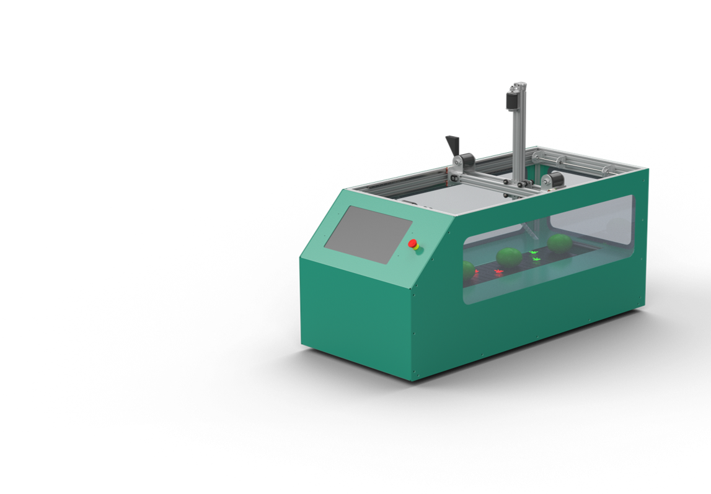
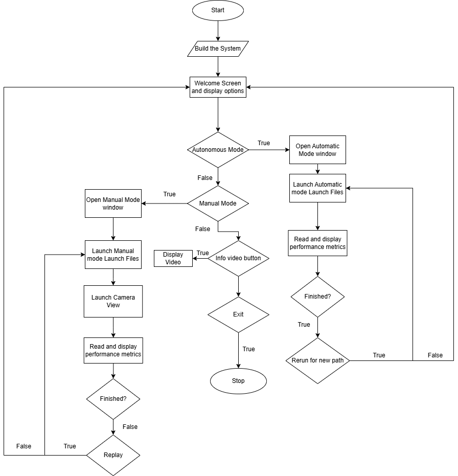
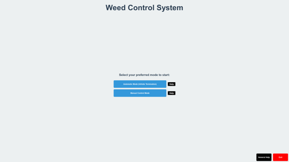

# Weed Terminator Demonstrator

## Project Overview
The **Weed Terminator Demonstrator** is a robotics system designed to showcase the elimination of weed using automated techniques.
The system utilizes vision software integrated into system for precise and efficient weed removal. This GUI is designed for 
user interaction by allowing the user to choose between different modes and providing instructions for use. 
It also displays key performance metrics of the demonstrator, offering real-time feedback. Additionally, in manual control mode, 
the GUI integrates a camera view to enhance user control.

## Demonstrator

## Why Python and PyQt for the GUI

I chose **Python** and **PyQt** for the **Weed Terminator Demonstrator** project for the following reasons:

- **Ease of Use (Python):** Python's simple syntax and readability allowed for ease of learning and easy debugging. Additionally, it offers lots of online resources. 
  
- **ROS Integration (Python):** Python is widely used in ROS, providing easy integration with ROS.

- **GUI Development (PyQt):** **PyQt** has a designer called **QtDesigner**, which is great for visualization.

- **Personal Development:** Python will be a great learning experience as I have little experience with it.

This combination ensured a powerful and user-friendly system for demonstrating autonomous weed termination.

## Some GUI Features
- **Automatic Mode:** Simulates the continuous operation of the system for weed termination.
- **Manual Control Mode:** Allows users to manually control the weed terminator's movement using a dualshock 4.
- **Camera Integration:** Displays a live camera feed to assist with weed detection when using the controller.
- **System Calibration:** Automatic system calibration before any interaction with the user.
- **Performance Metrics:** Displays metrics like the speed of the positioner.

## High Level Flowchart

As one can, see the GUI first beings by build the system, after it successfully builds the system the welcome screen opens.
In the welcome screen you are displayed with some options as you can see in the image below. If you were to launch the 
*Autonomous Mode* you will be directed to its own window where it will run the launch files to run the demonstrator until finished.
Additionally, there is a second option *Manual Mode* where the user can use a dualshock 4 controller to control the positioner to burn 
the weed manually. There will be an option to race the machine with replay button which will make the system race the user after the user is done.
There will be a Zed 2 camera for view to assist the user. Performance metrics (Speed and position of the demonstrator) will be shown for both modes.

## First GUI Design

As seen above, this is the welcome screen for the GUI. There are a couple of buttons two of which are the manual and automatic
modes for control.